# Text Retrieval

Standard Text Information Retrieval System:

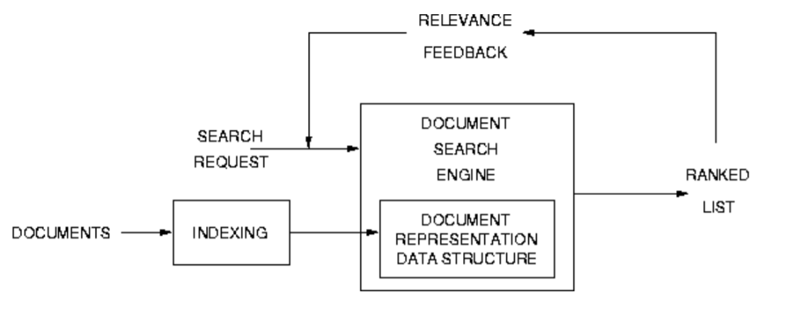

### Components of this IR System

- **Document Collection:**
  - published/professional documents; business reports, newspaper articles
  - web documents, collected using web spider crawling
  - social media contents e.g tweets
  - _documents need to be **preprocessed** into a standard format; case conversion removal of SGML/HTML or other markup, stop word removal, stemming_

- **Document Indexing**
  - convert documents into a file structure for rapid access e.g inverted file

- **Search Request**
  - users enter search request to express their information need
  - apply text preprocessing as per doc collection

- **Document Searching**
  - calculate set of potentially relevant docs to return to user
  - usually ranked by score indicating _likelihood of relevance_, based on mtch of the query with each available document

- **Relevance Feedback**
  - Modify the search; expand query using extra search items based on relevance data, re-run the search

**Typical IR system contains the following**:
- Documents/pointers to documents
- list of **terms**; processed words used to index the document contents
- representations of the documents, representing full open vocabulary text.
    - *The response of such systems is the same for all users - assumes the contents/characteristics of the doc archive are static.

## The Nature of Text

Text is composed of **word tokens** taken from a (small) vocab - 10GB or web documents has around _160,000 unique words_. Each token conveys some meaning, usually ambiguous.

Word **morphology**: word _attributes_ eg. tense, single/plural etc

- changed as words are combined into phrases and further into sentences when used in Natural Language.
- for each language there is a grammar of _syntactically allowable_ word combinations to which phrases and sentences should conform.

Properly formed sentences are constrained to the grammar to which they should conform.

No way of enforcing the use of the accepted grammar of the language by the authors of documents

In formal publications, an editor can seek to ensure writing standard, but may fail! May choose to break rules to effectively use their language. Also so many typographical errors, even in published texts..

**Sentences** ---concatenated into--> **prose** -----> **documents**

Suficiently large documents can be organised with structural elements eg sections, chapters

- These can be organised using hierarchies to ease navigation through the doc.
- docs can be linked with **hypertext** (see chap 2). This has important implications for Web Search.

### Variations in Text Style

- Classical Literature vs. Modern Prose
  - changes in vocab, standardised spellings
- spoken vs. written language; big differences when searching for spoken content
- sub-languages
  - weather reports
  - legal documents - formal, wills, deeds, specific use of vocab and grammar is vital.
  - emails, blogs, tweets, SMS - ungrammatical, full of abbreviation, dialect, slang
- Technical Documentation
  - terse, tight prose, complex phrases
  - office memos are less complex versions of tech docs
- Journalism
  - short easy to read sentences, depending on paper
- Storybook prose
  - can be complex, but should be easy to assimilate (entertainment reading)

## Indexing/ text preprocessing

Careful content preprocessing improves effectiveness and reliability in IR. Must be **entirely automatic** to tackle large volume of data. Usually need to be language specific to differ between languages.

Use **semantic analysis** in Automatic Indexing to interpret a request's meaning. Most requests are underspecified. Try to adapt to nature of request.
- If identified as a question, it can be passed to an **augmented IR system** called a question answering system.
- **tokenization**: extracting indexing units from text. Chopping up and processing text strings into units that form the basis of indexing units for retrieval.
- **token** a sequence of characters in a document that are grouped into a _meaningful semantic_ unit
- Note: an indexing unit may be a word, a phrase or a part of a word..
- **term**: processed token to be used for search, all the term units used for retrieval form the **dictionary** of the IR system.
- Note: Stop Word Removal is the deletion of tokens, they are not indexed

Do we delete or keep unusual domain specific tokens (email addresses, C+++, aircraft B-52 etc), or keep (parts of) them?

Use the frequency a word occurs in a document to measure significance? **no**, frequent words actually have low resolving power!

A good indexing term helps to discriminate one subset of a collection as relevant to request, they reflect a relationship between a document and the collection from which it is selected and enable selection of relevant documents from among the on relevants. Good keywords for retrieval are **not** the most frequent or the rarest, but occur a moderate number of times. _Zipf's 1st Law: frequency X rank = constant_

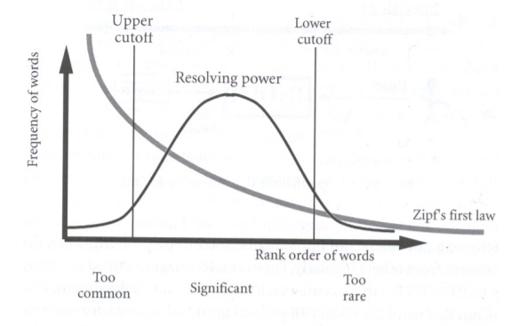

Because high frequency words aren't too helpful, they can be removed during indexing without impacting on retrieval effectiveness. This is **Stop Word** removal. Typically prepositions and conjunctions - _the, of, a, and_ etc. A list of stop words is usually chosen by experiment or by a standard list eg _Rijsbergen 1979_.
- Reduces computer memory requirement by >50% by just removing a few stop words! Also improves search efficiency.

**Conflation**: procedure designed to bring together words related to each other in some way eg stop, stopping, stopped -> stop. Creates search terms from search tokens.

Conflation good for tackling incorrect spelling, alternate spellings, multi-word concepts (Database vs Data base), Transliteration (silent letter omission), Affixes, Abbreviations/Contractions and Historical spelling changes.

- A note on Affixes.. **only words differing in their suffix are semantically similar**
  - those differing in **prefix** tend to have different meanings eg Possible and _Impossible_.

Two classes of conflation algorithms:
- **stemming algorithms**
  - match the ending of a word against a _suffix dictionary_ (requires either manual or automatic creation of this dictionary), the end of every word in a query is compared
    - **Longest Match** comparison, removes longest stem from word initially
    - **Iterative Search** removes first matched suffix, but keeps going until all possible matches made.
        - _Porter stemming_ is a popular iterative stemming algorithm
  - remove any suffix that is identified
  - check whether any context-sensitive rules apply
    - Inappropriate stemming actions detected by means of a minimum stem length eg -ATE should not be removed from CREATE, or by specifying exceptions eg "do not stem the word SING".
- **string-similarity measures**

In both, comparisons and processing resemblances are based on _measure of character_ and _character-substring similarities_.

Manual evaluation suggests that roughly 95% of words can be processed to give reasonable stems. Changing stemming rules to correct stemming errors tends to introduce new errors. Suggested that word stemming makes retrieval _slightly_ more effective.

**ERRORS**
- Overstemming can result in many unrelated words being stemmed to the same term
- Over/understemming of semantically related words can lead to failures to match during search

To acheive IR in other languages, IR techniques for English should be adapted to these new languages. Most IR algorithms don't make any underlying assumptions about the document language so doon't need much adaption. **preprocessing tokenisation** and **term creation** need significant modification, as word-level tokens and grammars are varied between languages. **Language specific stop word** lists must be created.

- take into account the 
- **productive languages** rely a lot on compound words (German, Dutch)
- **agglutinating** language has no spaces (Chinese, Japanese)
- **semitic** language is written right to left (Arabic)

_Cross-language IR_ uses machine translation to cross the languae barrier and translate queries/docs

_Multilingual IR_ refers to retrieval from collections with info in more than one language

#### Search File Structures

Important factor in determining the speed of an IR system response to a search request

Easiest way to compute the matching score between the query and each doc would be to compare each query term agains each term in each document - this is v _inefficient_

Need a data structure to mininmise the computational cost & maximise efficiency and speed of the query/doc matching operation when a request is entered

- maximise speed by considering **only** the terms in documents that have been specified by the request.
- to record the presence of each term in each doc will take _more time in preprocessing and indexing_ than tokenising + conflation
- Data structure to store this info will require _more space_ than just storing documents
- **trade off** between space requirements, offline processing (indexing) and online processing (search)
    - using more space and more complex offline processing enables faster and cheaper online processing.

For years the principal file structure for IR systems has been **inverted file**

**Inverted File**: a data structure that _maps content to its location within a database, a doc or a set of docs._ Can be _record-based_ if just referencing the docs in which a word appears, or _word-based_ if they also include the position.

Composed of:
- **Vocab**; term list containing all distinct words found in a text
- **Inverted List**; list of Statistics about the occurrences of each word

Stores mapping of words (content) to their location in docs in which they appear.

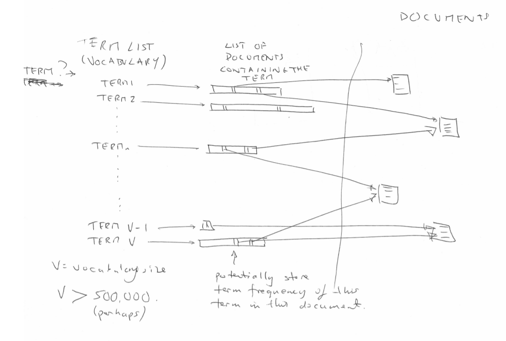

### Storing Term Locations

It's useful to search for multiword compunds/phrases associated with a matched term rather than the just docs with the individual words

- **Luhn's analysis of text docs** shows that terms appearing in close proximity are likely to be semantically related (within 5 words apart)
- therefore, if query terms appear close together in one document they are more likely to refer to the same thing.

Term data in the inverted file can be extended to include the location of each term within each doc (will make inverted file larger); this can be used to incorporate term proximity into retrieval matching function.

- this can allow for phrasal searching
- means higher score can be given to docs where the query terms are closer together

Many options for for storing location info:

- **Biword indexes**
    - consider every _word pair_ in a doc as a phrase
    - treat each word pair as a vocab term
    - build an inverted file storing details of qhich documents contain which biwords
    - process longer phrases by breaking them down into pairs
    - extended biwords used for longer phrases including stop words; words in a phrase tend to contain the same stop words, so removing will give the same matching pair
    - **EXAMPLE** 
                    
            "cost overruns on a power plant"

            forms

            "cost overruns" AND "overruns power" AND "power plant"

    - big size implications with biwords..
    - phrases consisting of _common words_ ef "John Smith" best stored in a biword index

- **Positional indexes**
    - The document and word position within that doc [title] are considered
    - Rather than store phrases in an inverted file, phrases can be identiied when the query is entered
    - **EXAMPLE**

        Doc1: "Information retrieval systems"
        Doc2: "Database management systems"
        Doc3: "Retrieval of information from computer systems"

        Terms locations..
        "computer" --> Doc3/5
        "database" --> Doc2/1
        "system" --> Doc1/3, Doc2/3, Doc3/6
    - good for saving space but not for considering multiple word combinations
    - good for phrases where individual terms are relatively rare eg "Britney Spears"

_How to know where to find terms appearing in queries within the inverted file?_

- order in which they first occured when processing the docs (when they were added to the I.F) is efficient
- Sorting the vocab of the inverted file alphabetically and using an array to indicate the first location in inverted file list of a word with each leading letter. This would involve a lot of comparisons tho
- a **hashing table & hash table** is far more efficient
    - must be repeatable
    - ideally have an even distribution
    - minimise synonyms (where synonyms occur, string matching may be required)

**Term lookup efficiency using hash**

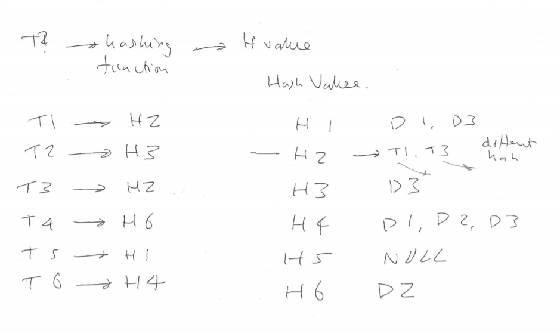

### Preprocessing Summarised

**Search archive** consists of _document representations_, stop words removed and terms conflated, in an _inverted file structure_

This inversion process is time consuming and expensive to build and maintain when the doc collection changes

---

## Retrieval Models

Operationally, main distinction between Boolean and Best-Match searching models. Early IR used Boolean (expert searchers), more recent work has shifted to focus on best match. Most current IR systems are hybrids of both.

Distinct approaches developed to best-match:
- Vector-Space Model
- Probabilistic Model
- Language Modelling
- Divergence from Randomness Model

### Boolean Text-Retrieval

Use of AND, OR and NOT logical operators

Traditionally used by trained intermediaries (librarians), who could choose the database to search, identify terms to highlight in a query, refine queries etc

**postings info**: an essential piece of info for effective Boolean IR

- postings value == number of entries a term has in the inverted file (how many docs within a collection it occurs in)

**Limitations to Boolean IR**: 
- High complexity in forming queries
- lack of control over size of output set produced
- no mechanism for ranking the output
- all terms are taken to be equally useful in determining relevant docs

### Best-Match Search

Corresponds to the situation of a ranked output list of potentially releveant docs with which we are familiar. Ideally ranked in decreasing likelihood of the doc being relevant to the user's info need

The similarity between a doc and a request is a _function of the number of search terms they have in common_

An effective best match system requires:
- weighting scheme to reflect importance of different indexing terms, determining effective tems for search and incorporates this info into ranking the list of returned docs
- a matching score between the query and each doc, providing a similarity coefficient

**Advantages**
- no complex queries
- complete control over output size
- can differentiate between terms using term weighting schemes

**Limitations**
- absence of phrase and multi-word terms..
- not able to use synonyms, achieved witha boolean OR
- query needs to contain several terms to generate meaningful rankings

### Term Weighting

Used to achieve better retrieval perfomance, allows terms with high utility in differentiating relevant docs to be emphasised. Uses selectivity

- **Collection Frequency**
    - 'terms that occur in fewer docs are more valuable than those occuring in many documents'
    - Collection Frequency Weights AKA Inverse Document Frequency Weights:

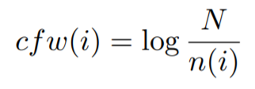

    - t(i) == search term
    - n(i) == number of documents t(i) occurs in
    - N    == number of documents in collection archive
    - the logarithm can be taken to any convenient base

- **Term Frequency**
    - 'the more often a term occurs in a document the more likely it is to important for that document' - refers to term's within-doc frequency
    - While a terms collection frequency is the same for any doc, the document freq varies
    - tf(i,j) == number of occurences of term _t(i)_ in document _d(j)_.

- **Document Length**
    - 'document relevance is _independant_ of document length'
    - a term occurring the same no of times in a short doc and a long, is likely to be more valuable to the shorter.
    - dl(j) of document d(j) == total number of term occurrences in d(j)
    - Without compensating for doc length, longer documents will tend to have higher matching scores because more chances for a term to occur..
    - One _compensation method_ is the normalised average doc length:

    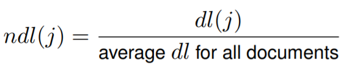

**tf x idf** is a commonly used empirically derived weighting scheme, where the term frequency (tf) is multiplied by the collection frequency weight (idf)

    w(i,j) = f(tf(i,j)) * idf(i)

    where w(i,j) is the weight of term i in document j

Some tf(i,j) functions:
        
    f(tf(i,j)) = tf(i,j)

    f(tf(i,j)) = 0.5 + 0.5(tf / maxtf)  // maxtf is the max term freq in document j

    f(tf(i,j)) = log(tf(i,j) + 1)

#### VECTOR SPACE MODEL

Both the docs and queries are represented as vectors in a _t_-dimensional space, where _t_ is the _no of unique index terms_ in the collection

**degree of similarity** between doc d(j) and a query q is calculated as the _cosine of the angle_ between the two vectors

**a.b** = |_a_||_b_|cosθ

The **similairty** between the query and each doc d(j) computed as:

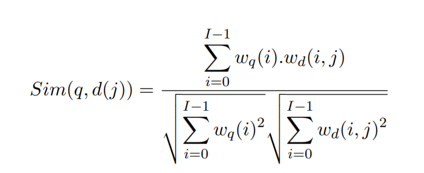

Documents are ranked in **decreasing order** of similarity (Highest sim first)

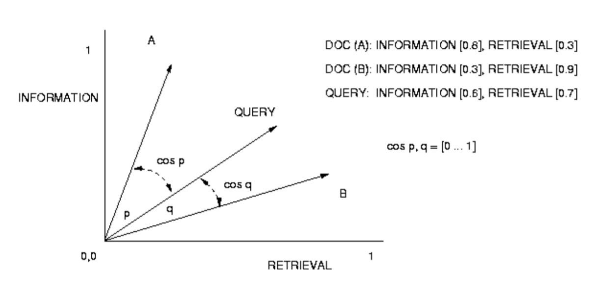

In the above example, cos(q) > cos(p) so B is more similar to QUERY than A, hence B is ranked higher

Note: Matching score assigned to a doc isn't a probability of relevance, but rather a _measure that attempts to estimate how much evidence there is in favour of this doc being relevant_.

#### PROBABILISTIC MODEL

Attempts to compute the probability that a document is relevant to a query, given that it possesses certain attributes or features. 

To derive the prob model, it is assumed that
- each doc is either relevant or irrelevant to the query
- judging one doc to be relevant or irrelevant tells us nothing about another doc's relevance.

_Probability Ranking Principle_ says that ranking docs by decreasing order of probability of relevane to a query will yeild the optimal ordering based on available data

Matching Score (ms(j)) for doc d(j) calculation _similar_ to other ranked retrieval schemes:

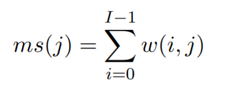

w(i, j) is a probabilistic weighting scheme and I is the set of all search terms

**Okapi BM25 combined weighting** is an effective probabilistic model developed at City Uni London:

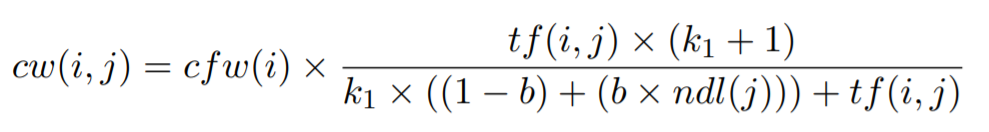

where 
- cw(i,w) == combined weighting scheme 
- ndl(j) == normalised length of doc j
- k1 and b are _experimentally determined constants_ to control the effect of tf(i,j) and the degree of length normalisation respectiely

    - k1 factor determines impact of term frequency in a document, typical value is 1.5

    - b determines the degree of doc length normalisation. Varies between range 0 to 1

- with 0, no adjustment made to term weight to take into account the doc length, so cw(i,j) for term t will have higher value if j is a longer document
- with 1, maximum application of adjustment applied. Shorter docs will have an increase in the cw(i,j) value compared to a doc of average length. Longer docs will have ndl(j) values > 1.0, so will result in a decrease of the cw val compared to document of average length.

Retrieval effectiveness can be measured using precision, recall or another standard IR eval metric

---

## Relevance Feedback

Uses relevance info from an initial retrieval run for the current query to:
- add significant terms from relevant docs to the current query
- modify the weights of terms to improve the ranks of documents which are likely to be relevant

Can come from three possible sources:
- Explicit feedback, user marks documents from current run as (non) relevant
- Implicit feedback, system assumes that returned docs clicked on by a user are relevant (assumes that snippet summaries/doc titles are reasonable indicators of relevance)
- Blind/Psuedo feedback, system assumes the top ranked docs are all relevant

Assumptions made:
- User assumed to know enough about the topic to make a reasonable initial attempt at a query
- Relevant docs are assumed to be similar to each other, and additional unseen relevant docs will be similar to those already known. This means that relevant docs will be dissimilar to non-relevant ones, allegedly

#### In Vector Space Model

Query Expansion == adjusting term weights in the query vector

Adding a new term to the query == giving this term a non-zero weight in the vector

Emphasizing/reducing the importance of a query term == inc/dec its weight

Standard relevance feedback for Vector-Space IR developed by Rocchio

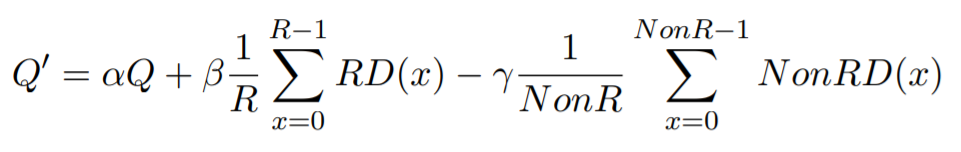

    Q' = modified query vector
    Q = initial query vector
    R = no of KNOWN relevant docs
    NonR = no of KNOWN non-relevant docs
    RD(x) = relevant doc vector x
    NonRD(x) = non-relevant doc vector x
    α, β, γ = empirically determined constants

Rocchio is an empirical method _without_ underlying formal theory

Variants on Rocchio, investigations on
- reweighting original terms and not adding any nes
- only adding highest weighted new temrs
- only using relevant docs to complete Q' (set γ = 0) 

#### In Probabilistic Model

Term reweighting and query expansion are treated separately

- Computing relevance weights asks "How much evidence does the presence of this term provide for doc relevance"

- Selecting new terms to add asks "How much will adding this term to the request benefit overall performance of the search formulation?"

Terms **reweighted** by replacing cfw(i) with _rw(i)_ (The Robertson/Sparck Jones weight)

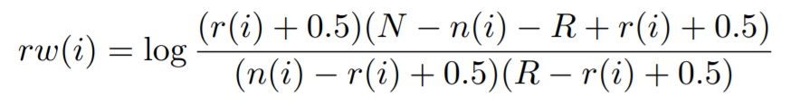

    n(i) = number of docs t(i) occurs in
    N = total number of docs in collection archive
    r(i) = number of KNOWN relvant docs term t(i) appears in
    R = total number of KNOWN relevant docs in collection archives

    0.5 constants added for smoothing, prevennts rw(i) being set to 0 for tems in a query not yet observed in a relevant doc

All terms appearing in relevant docs are potential query expansion terms, firt ranked using the Robertson offer weight

    ow(i) = r(i) x rw(i)

Top ranked terms then added to original query - terms with high ow(i) vals need both high f(i) and high rw(i) vals.

During query expansion, original query terms usually upweighted using a scalar constant (since these were entered by the user, more reliable than automatically selected expansion terms)

This constant multiple α is typically set between 1.5 and 3.5, and the relevance feedback of cw(i,j) is multiplied by α.

#### Data Fusion

Merging process, where ranked lists generated independently by diff IR systems are merged to give an improved overall retrieval list

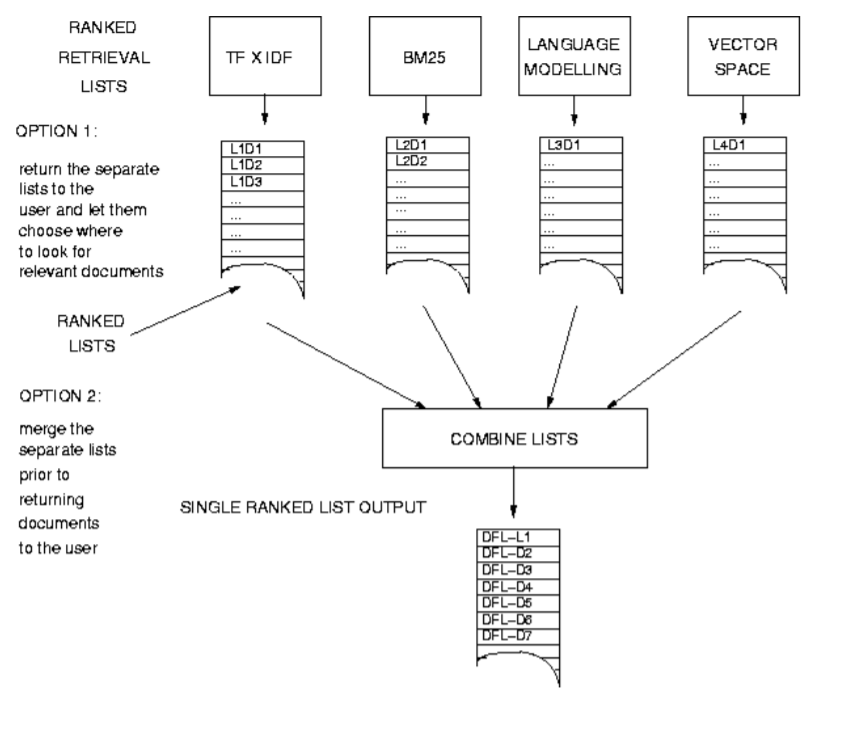

Because diff weighting schemes are likely to produce matching scores which are incompatible, we may need to look at how we combine all the list

Merging methods:
- **Raw Score**: ignore score incompatibility issues, merge docs based on query-docs matching scores
- **Normalised Score**: for each list, divide the query-doc matching score of each doc by the _maximum score for the list_ (Max score = 1.0). Then merge as per Raw Score.
- More complex methods explored but not here

---

## Evaluating IR systems

Difficult to measure how one system is better at achieving its objective. Needed to adopt a formal evaluation process

Also have to ask whether the system works as designed; even if it builds and produces sensible numbers, could there be any algorithmic errors?

Two categories of evaluation:

- **Qualitative evaluation**
    - users provide feedback on their views of the use of a particular IR system while using it to complete a certain task
    - evaluated either during or after tackling the task
    - neither ideal, disruptive to process during, may omit parts when eval after
    - _user centered_ eval
- **Quantitative evaluation**
    - Numerical eval of the effectiveness of an IR system, may involve interactive tests witha a user or in lab based experiments
    - Interactive eval of a live system
    - using test collections

Relevance of retrieved documents can _only_ be judged by a human

To run a lab based IR experiment:
- enter the docs into each IR system to be evaluated via indexing
- put each into each system
- calculate the matching score for each doc for each request in each sys
- collect the output

Then

- evaluate the output for each request, doc by doc, using the relevance data for each request
- analyse results

Measurement for the ability of an IR system to retrieve relevant docs is **recall**

Measurement for the ability of an IR system to not retrieve non-relevants is **precision**

    recall = (no of relevant docs retrieved) / (total relevant docs in collection)
    
    precision = (no of relevant docs retrieved) / (total docs retrieved) 

Mean Average Precision (MAP) is a single measure of search effectiveness for best-match IR. The mean of the folowing:

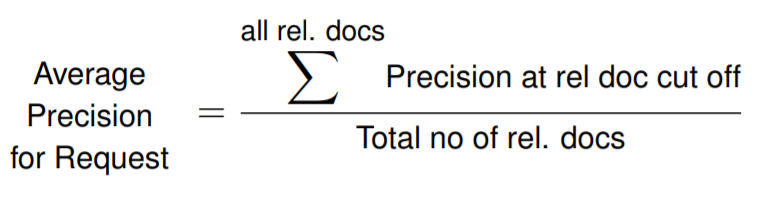

- generally a higher recall and precision indicate a better IR system
- often found that adjusting an IR system to improve recall will impair precision, vice versa
    - op systems usually produce a task specific compromise between the two

Test collections should be designed carefully.. think about:

- Scale -> number of docs in the collection and the size of the request set
- Documents -> just of one source/variety. Contents to change over time?
- Requests -> how well do they represent expected operational search requests
- variety -> how docs/requests would be represented in the IR system, how they are used within the IR system
- relevance judgements -> how they are gathered, who judged

**Pooling**: combining and assessing the output of a number of search engines.

- retrieval output is obtained and relevance assessment carried out afterward
- retrieved docs down to agreed rank (eg 100) are formed into a union _pooled_ set of docs
- contents of the doc pool are sorted into random order to prevent sequence biasing effects
- relevance of each doc in the pool then judged manually.

For pooling to be effective, the IR systems used to create the pool must be as _diverse as possible_

Text REtrieval Conference (TREC): an iternational IR evaluation workshop, where participants are given a set of docs and retrieval requests, they submit the retrieval outpus by a strict deadline, and performance is then computed for agree d evaluation metrics after pooling the results from the participants

CLEF, NTCIR, FIRE, MediaEval also used
