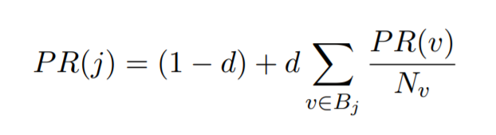
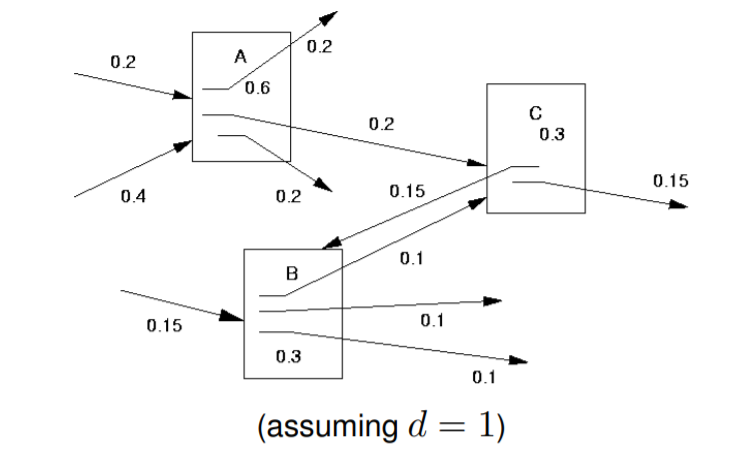

# Web Retrieval

Most peoples most-used IR system. Companies offering web search engines aim to exploit all available info to provide the most effective possible search tools.

Typically look for the folllowing features:
- interactive processing of search queries (online)
- effective ranking of relevant content
    - no need to click a "next page" button motivates need for this; most people don't know how
- Very rapid response time

In Practice, Web search's documents...

- are of a variety of content, style, length, format
- varied qualities of authorship (spelling, grammar)
- contain deliberate misinformation (spam)
- mirror sites mean duplicate info between publications

and search requests...

- written quickly, little attention to detail
- very short (2-3 words), poor description of info need

Many steps taken to improve ranking of Web Content, **learning to rank** using the following _signals_

- link structure of the web
    - relationship between source and linked pages
    - see _PageRank_
- "spamminess" detection
- content diversity
- user interaction, click logging
- subjective quality of page

For unlinked (flat) docs, we can use the metadata such as source/author of the doc to determine its importance

#### PageRank
takes advantage of the link structure of the web to produce an approx global score for each page. This pagerank is independant of the contents of any given file

- j = the WebPage
- Fj = set of web pages j points to (outedges)
- Bj = set of web pages pointing to j (inedges)
- Nj = |Fj| = number of links from j
- PR(v) = PageRank of webpage v, which points to j
- Nv = number of outedges from v
- d = constant, usually set to 0.15

Note that for a page _v_ pointing to the page _j_, it's contribution to _PR(j)_ depends on the number of links from Page _v_. Assuming _d_ = 1 ..

- Page _A_ has 3 outlinks, it's pageRank is 0.6, since there are 3 outlinks it contributes 0.2 to the pageRank value of each page it points to.

PageRank is the probability that a 'Random Surfer' will visit the page.

- Random Surfer starts at a random page and keeps clicking on links, never going back
- Eventually gets bored and begins on another random page
- (1 - d) = the probability that the surfer gets bored and will move to a new random page
- d indicates the influence of parents/ancestry of the current webpage. If 1, they will always stay on the same link path, if 0 they always randomly switch (and all pages have PR(j) = 1)

Whatever value we start with for PageRank, we eventually end up with the same limiting values

#### Spam Filtering

Spam defined as _content that will never be relevant to a query_. Usually designed to be detrimental to the behaviour of search engines.

Spam Filtering services identify this kind of content and remove it

Spam usually tries to promote the rank of a document by:
- **Self-Promo**; commonly by keyword stuffing - adding content to a page to increase word counts, adding words that are invisible on a page
- **Mutual Promo**; using _link farms_ -  plausible looking web pages which attempt to manipulate PageRank type measures by inflating link counts of their target pages

**Adversarial Search**: the continued process of link farm operators adversely influencing a search engine

Collections of test spam docs are used to train spam classifiers. Assign a spamminess score to each doc

#### Query Sense Identification

Queries can be **ambiguous**: unclear, v short, different interpretations eg "cancer" - info on disease, diagnosis, reasearch, star sign? Best to use **Diversity** strategies to make as many of these options available in retrieved results.
- **implicit diversity**: compare retrieved documents to each other, select documents for display which are most likely to be _relevant to the query_ while being _most dissimilar from each other_.
- **explicit diversity**: account for different aspects of the query, _Identify interpretations for the query_ and classify retrieved documents for each of the sub-queries.

Display the highest ranked documents for each interpretation of the query in the SERP. If the user selects a doc from the list, _apply relevance feedback_ to find more docs like this and re-rank similar docs

Some special cases:

- "apples" != "Apple"; a query on the latter probably relates to the company rather than the fruit. Should not apply stemming here!
- "bio" == "biography"; a common abbreviation. Can apply what would normally be considered overstemming here.

**Filtering repeated copies** of content on the web is a major challenge. Automatic filtering can be used to remove docs containing duplicate content from display in the ranked list to diversify the web retrieval.

#### Click Models

**Web logs**: user activity captured to record queries, timestamp of submission and list of docs retrieved/subsequently clicked. Can be used as implicit user relevance feedback of retrieved docs, will be _noisy_ but volue of data from multiple submissions of the same query can be used to smooth out much of the noise.

The **query-clicked document** relationship indicates potentially relevant documents for each query. Can be clustered based on the similarity of the contents of the docs and these clusters are more likely to correspond to alternative interpretations of ambiguous queries.

Click info can be used as an assessment of the user experience in using the search engine + improve effectiveness of the s.e

- How many clicks on the SERP for the query - is the user confused?
- average rank of the clicks - low rank indicates poorer rank of relevant content
- diff ranking algorithms produce more clicks nearer the topic of the ranked list? Clicks nearer top mean less work for the user.

**Click Models** attempt to model user search behaviour based on web search logs to predict future activity

- can estimate doc relevance based on search behaviour. This relevance val indicates the degree of correlation between the query and the likely relevance of each doc
- inferred relevance values for retrieval for a query can be used as input to a ranking model for search if this query is entered again by a new user.

Content **freshness** refers to how recently content was created or changed.

- simply biasing in favour of new pages **degrades** search results over time - users don't always want the most recent
- Google "**Query Deserves Freshness**" (QDF) attempts to determine when users want new info or not.
- if a "hot" news site or blog is heavily interacted with, google determines this topic as hot and related queries receive "fresh" content in response to them.
- Important to give the user content relating to a hot topic from trusted news feeds. Particularly challenging for microblogs (Twitter)

#### Search Engine Optimisation

SEO refers to the _process of adjusting the contents_ of a web page/sit to _maximize its ranking in the output of a search engine_

**Spamdexing** / **black hat SEO** = the process of adjusting contents of a web page/site to promote rank in _contravention_ of the search engine guidelines for Webmasters. Serch engines may eliminate or downrank web pages/sites suspected of this.

Factors considered spamdexing are:
- Keyword Stuffing
- Link schemes
- **Cloking**: presenting diff contents to search engine spiders and user browsers
- **deliberate creation of duplicante content**: copying excessive amounts of material between pages to increase a page's Rank

_Google Penalty_ aims to decrease the rank of these sites. Google Penguin algorithm aims to decrease rank of sites violating Google's webmaster guidelines

- **Panda** algorithm lowers rank of 'low quality'/'thin' sites and place high quality sites near top of results. Introduced by Google as part of their doc ranking function improved the rank of news websites/social networks and demoted ranks of sites w loads of ads
- defined 23 bullet points on its blog answering the question "What counts as a high quality site" to help webmasters step into Google's mindset. [This is the link](https://webmasters.googleblog.com/2011/05/more-guidance-on-building-high-quality.html)
- To create a Panda Score:
    - Human judges rate quality of thousands of sites based on measures of quality including; design, trustworthiness, speed and whether or not they would revisit.
    - Google use a machine learning algorithm to look for similarities between websites that the judges found to be high or low quality
    - These characteristics are then used to classify unseen websites and incorporate this classification score into overall ranking of a site
- Panda **decreased importance of PageRank** algorithm in determining page score - affects the ranking of an entire website or a specific section of a website rather than just an individual page.
- Google have introduced a penalty for 'over-optimised' sites. This is to give sites with great content an increased chance of being ranked above sites with lesser content but better SEO.

Query-document matching score (as seen in Text Revtrieval), _ms(j)_, is a simple single measure to take all words on a page and treat them with equal importance. In reality different words have different levels of significance to a page.

Best to use _weighted linear sum of components_:

    ms(j) = a1 x factor1 + a2 x factor2 x ... x aN x factorN

where a1, a2 etc are scalar constants.
- **Learning to Rank** uses machine learning to automatically tune these scalar constants to train the ranking model.
- Factors include: no. of inlinks/outlinks, no. of reciprocal links between this and another page, URLLength of page (shorter indicates nearer to root), URLType of the page (root, sub root, path, file), no. of matching query terms in page

To train:
- Collect training set of queries w corresponding relevance data - use a _pooling procedure_
- For each query, obtain an initial doc ranking
- For top K docs in initial ranking, work out the values of the features to be used (spamminess score, click model score etc)
- Apply machine learning method to train optimal parameter weights to maximise ranking performance of the system. Parameters tuned to maximise a selected retrieval evaluation metric eg Mean Average Precision.

This is good for development of new IR techniques/extensions. Once system has been deployed, there are other eval opportunities available.

- A/B testing of operational online systems enables developers to evaluate new ideas w rapid feedback on effectiveness
- Let current system = A and a new ranking method = B
- Search engine provider can perform a live online experiment to evaluate user response to new ranking method. Both have same interface/interaction, just different backend ranking algs
- System A / B then assigned to each searcher at random when they access the user interface and submit a request to the search engine.
- responses of the user to the returned ranked list are then monitored & logged
- SE provider then able to evaluate how many retunred docs were clicked, rank of the clicked items, time between clicks etc.
- Number of users of an online search engine will typically mean that a large amount of log data attained v quickly
- compare A/B and determine which is better

Sometimes has counterintuitive/unexpected results..
- users found to engage more with a search engine to reformulate queries to make them more effective for the version of the SE where the ranking of relevant docs was found to have decreased...
